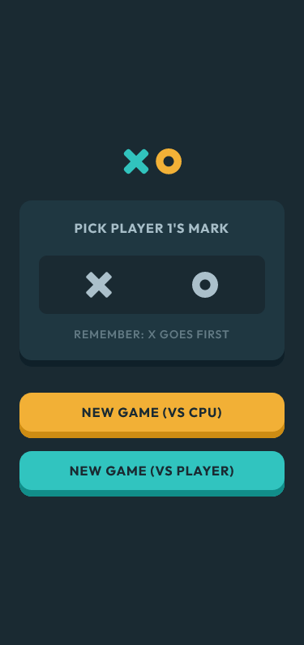
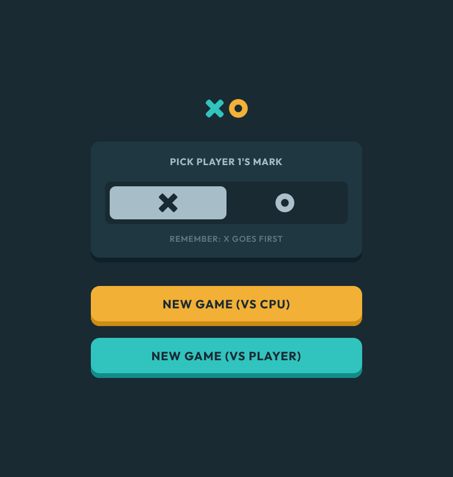
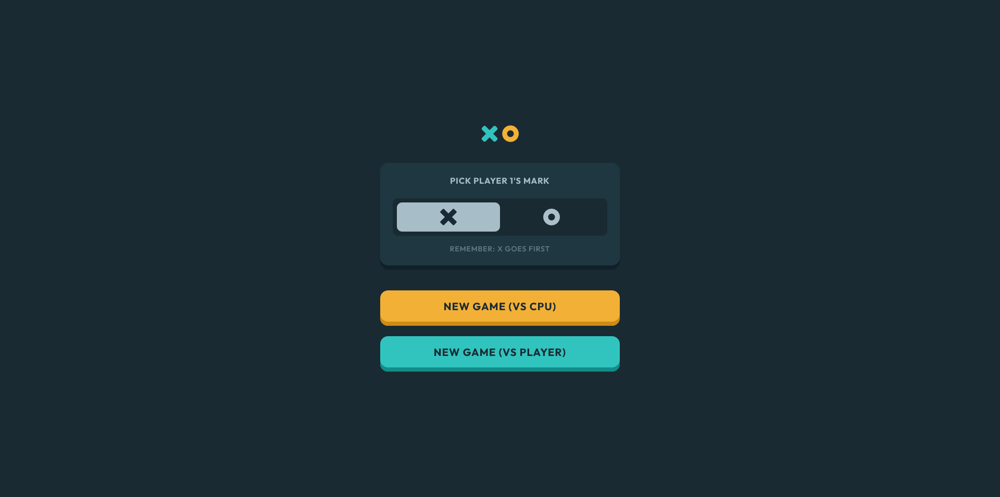
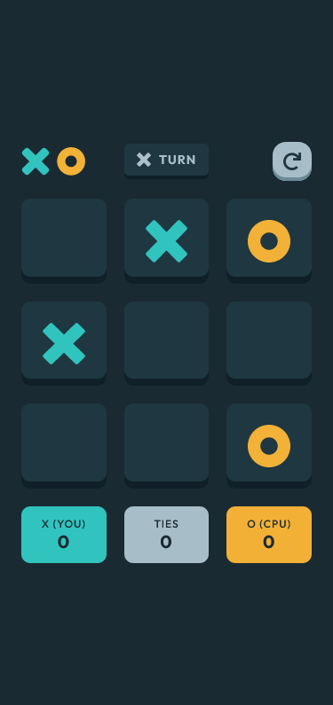
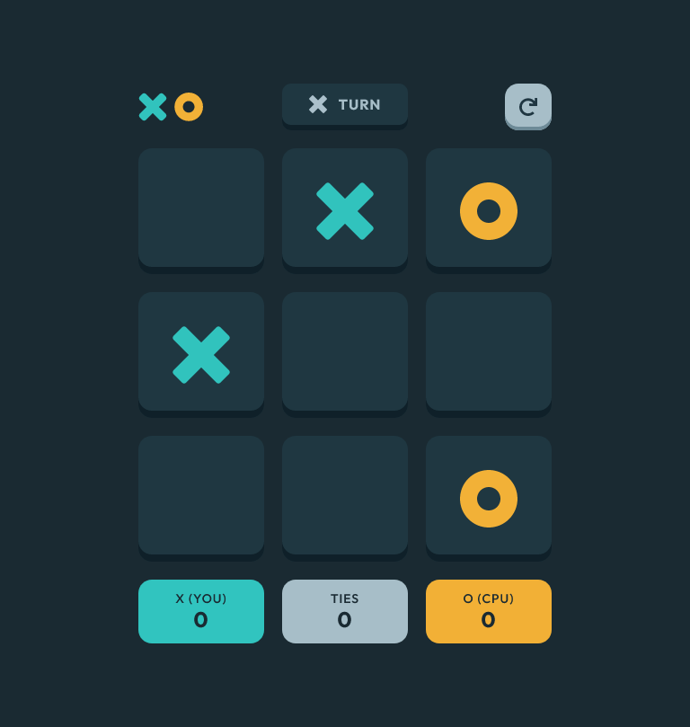
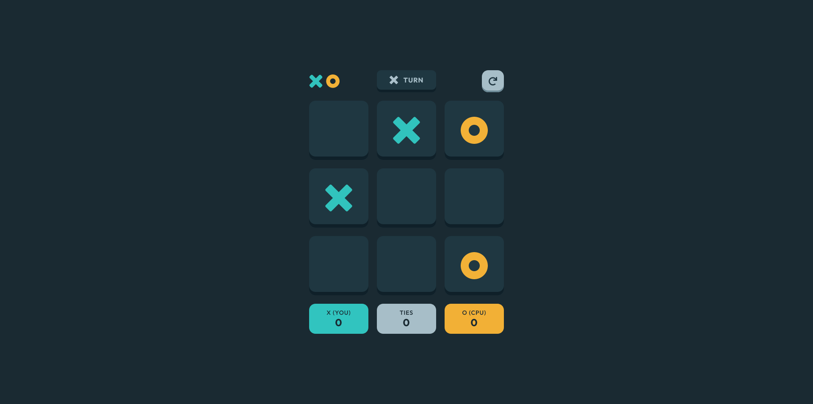

# Frontend Mentor - Tic Tac Toe solution

This is a solution to the [Tic Tac Toe challenge on Frontend Mentor](https://www.frontendmentor.io/challenges/tic-tac-toe-game-Re7ZF_E2v). Frontend Mentor challenges help you improve your coding skills by building realistic projects.

## Links

- Solution URL: [FrontEnd Mentor Solution Page](https://www.frontendmentor.io/solutions/tic-tac-toe-game-Nxfq5bGFhF)
- Live Site URL: [GitHub Pages Site](https://karolbanat.github.io/fem-tic-tac-toe/)

## Author

- Frontend Mentor - [@karolbanat](https://www.frontendmentor.io/profile/karolbanat)

## Screenshot

